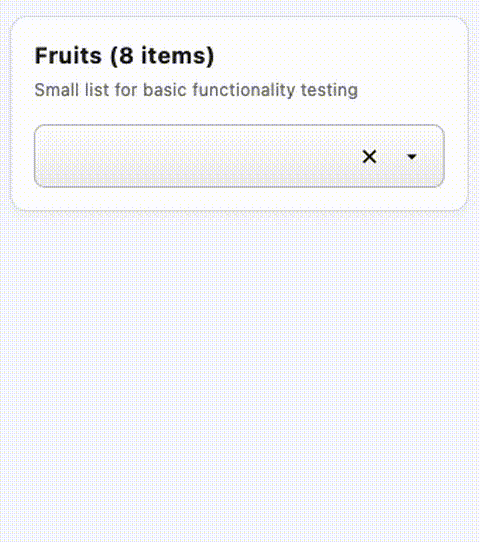
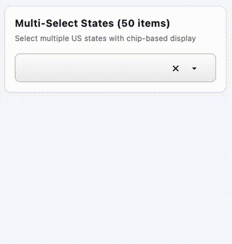

# Item Dropper

A customizable, accessible dropdown package for Flutter with powerful single-select and multi-select
capabilities, built-in search filtering, and full keyboard navigation support.

**[📦 View Package on pub.dev](https://pub.dev/packages/item_dropper)**

---

## 📦 Package

The main package is located in [`packages/item_dropper/`](packages/item_dropper/)

**For installation instructions, API documentation, and usage examples, see:**

### **→ [Package README](packages/item_dropper/README.md)**

---

## 🎨 Demo Application

The root of this repository contains a comprehensive demo application showcasing all features of the
Item Dropper package.

### Features Demonstrated

- Single-select dropdown with search
- Multi-select dropdown with chips
- Custom styling and decorations
- Add new items on-the-fly
- Delete items from list
- Group headers
- Keyboard navigation
- Accessibility features
- All customization options

### Running the Demo

```bash
# Clone the repository
git clone https://github.com/mauricev/item_dropper.git
cd item_dropper

# Install dependencies
flutter pub get

# Run the demo app
flutter run
```

---

## 📸 Screenshots

### Single-Select Dropdown



### Multi-Select Dropdown with Chips



---

## 🚀 Quick Start

Add to your `pubspec.yaml`:

```yaml
dependencies:
  item_dropper: ^0.0.4
```

**Basic usage:**

```dart
import 'package:item_dropper/item_dropper.dart';

// Single-select
SingleItemDropper<String>(
  items: [
    ItemDropperItem(value: '1', label: 'Apple'),
    ItemDropperItem(value: '2', label: 'Banana'),
  ],
  selectedItem: selectedItem,
  width: 300,
  onChanged: (item) => setState(() => selectedItem = item),
)

// Multi-select
MultiItemDropper<String>(
  items: items,
  selectedItems: selectedItems,
  width: 400,
  onChanged: (items) => setState(() => selectedItems = items),
)
```

**For complete documentation, see the [Package README](packages/item_dropper/README.md)**

---

## 📁 Repository Structure

```
item_dropper/
├── lib/                              # Demo application
│   └── main.dart                     # Comprehensive examples
├── packages/
│   └── item_dropper/                # 📦 The Package
│       ├── lib/                      # Package source code
│       ├── test/                     # Package test suite
│       ├── example/                  # Simple usage example
│       ├── README.md                 # 📖 Full documentation
│       ├── LICENSE                   # MIT License
│       ├── CHANGELOG.md              # Version history
│       └── pubspec.yaml              # Package metadata
├── pubspec.yaml                      # Demo app dependencies
└── README.md                         # This file
```

---

## ✨ Key Features

- ✅ **Single-Select Dropdown** - Traditional dropdown with single item selection
- ✅ **Multi-Select Dropdown** - Select multiple items displayed as chips
- ✅ **Real-time Search** - Filter items as you type
- ✅ **Keyboard Navigation** - Full support for arrow keys, Enter, and Escape
- ✅ **Add New Items** - Allow users to create new items on-the-fly
- ✅ **Delete Items** - Optional delete buttons for managing the item list
- ✅ **Group Headers** - Organize items with visual separators
- ✅ **Smart Positioning** - Automatically positions dropdown above or below
- ✅ **Full Customization** - Custom styles, decorations, and item builders
- ✅ **Accessibility** - Screen reader support and keyboard-only navigation
- ✅ **High Performance** - Optimized with caching and efficient algorithms

---

## 🧪 Testing

The package includes comprehensive test coverage:

```bash
cd packages/item_dropper
flutter test
```

**Result:** 250 tests, all passing ✅

---

## 🤝 Contributing

Contributions are welcome! Please feel free to submit a Pull Request.

1. Fork the repository
2. Create your feature branch (`git checkout -b feature/AmazingFeature`)
3. Commit your changes (`git commit -m 'Add some AmazingFeature'`)
4. Push to the branch (`git push origin feature/AmazingFeature`)
5. Open a Pull Request

---

## 🐛 Issues

Found a bug or have a feature request?
Please [open an issue](https://github.com/mauricev/item_dropper/issues).

---

## 📄 License

This project is licensed under the MIT License - see the [LICENSE](packages/item_dropper/LICENSE)
file for details.

---

## 🙏 Acknowledgments

Built with ❤️ using Flutter. Designed for developers who need powerful, accessible dropdown
components.

---

## 📚 Links

- **[Package on pub.dev](https://pub.dev/packages/item_dropper)** (after publishing)
- **[Package Documentation](packages/item_dropper/README.md)**
- **[API Reference](https://pub.dev/documentation/item_dropper/latest/)**
- **[Example Code](packages/item_dropper/example/)**
- **[Issue Tracker](https://github.com/mauricev/item_dropper/issues)**

---

**Keywords:** flutter, dropdown, select, multi-select, autocomplete, searchable, accessible,
keyboard navigation, chips
